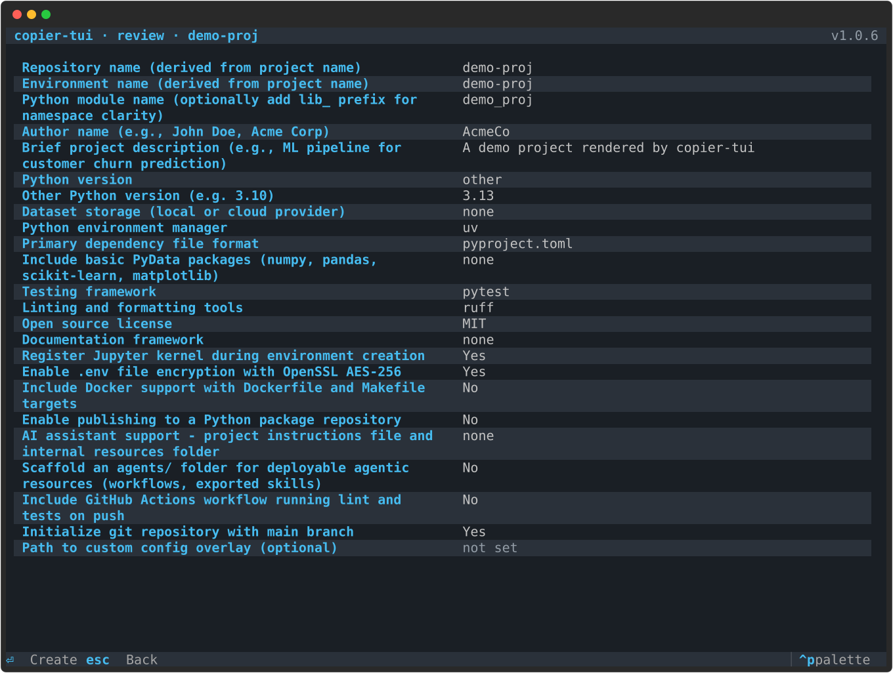
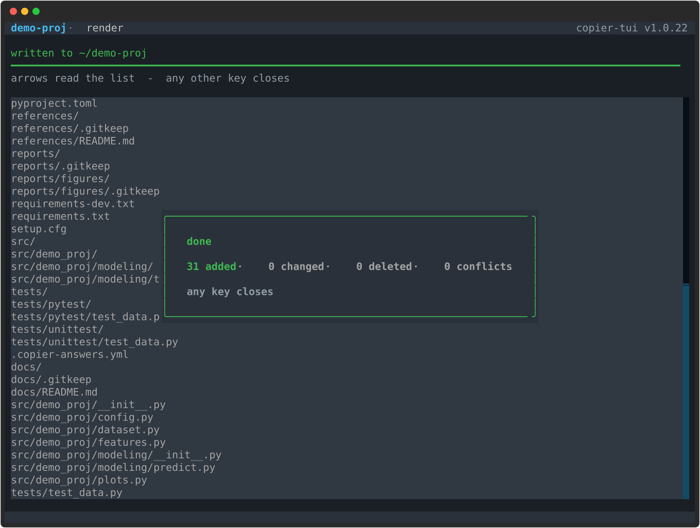

# copier-tui

[](https://github.com/stellarshenson/copier-tui/actions/workflows/build.yml)
[](https://pypi.org/project/copier-tui/)
[](https://pypi.org/project/copier-ui/)
[](https://pypi.org/project/copier-tui/)
[](LICENSE)
[](https://kolomolo.com)

Two packages that put a proper user interface in front of [copier](https://copier.readthedocs.io). `copier-ui` reads a template's question model and turns it into a deterministic, UI-neutral schema with state and validation. `copier-tui` is a terminal renderer built on that schema, letting the user move back and forth through the survey and only instantiate the template once they are ready.

## Install

Python 3.11 or newer. `copier-tui` pulls `copier-ui` and copier itself in with it, so one install
is the whole thing.

```bash
uv tool install copier-tui      # isolated, on PATH - the recommended route
pipx install copier-tui         # same idea without uv
pip install copier-tui          # into the current environment
```

Then point it at a template exactly as you would point copier at one:

```bash
copier-tui copy gh:stellarshenson/copier-data-science ./my-project
```

The survey opens, and nothing is written to `./my-project` until you confirm the review.

To build the UI on top of your own frontend instead of using the terminal one, install the
semantics layer alone - it renders nothing and needs no terminal:

```bash
pip install copier-ui
```

## Why

Copier's questionnaire is driven by `copier.yml` and its own interaction layer. Copier extensions are Jinja extensions, not pluggable questionnaire renderers, so there is no supported way to replace the prompt frontend. The workable route is to treat copier as the template engine and supply answers through its Python API - answers passed as data are never prompted for interactively.

```
copier.yml
    │
    ▼
copier-ui  ─ normalised schema, dependency graph, validation, visibility, answer state
    │
    ├──▶ copier-tui     terminal renderer
    ├──▶ copier-webui   browser renderer (future)
    └──▶ copier-api     HTTP / headless interface (future)
    │
    ▼
copier.run_copy(src_path, dst_path, data=answers)
```

Every existing copier template gets the alternative UI without any change to the template.

## Screens

The whole survey is one screen. A question is a caption and its answer on one line, and a
question answered by picking prints every option it was picked from on that same line, so what
was passed over stays legible beside what was taken and there is no menu to open over the
questions underneath. Left and right move between the options; nothing expands, nothing is
covered.

Rows alternate between two grounds so the eye can tell where one question ends, and the answer
to a choice sits on a filled chip while the options passed over stay plain beside it - taken and
dismissed differ by ground rather than by which blue is brighter. Anything that accepts typing
carries a lifted ground; an option row does not, so only what takes letters looks like it does.
A caption is coloured by focus alone and never by whether its answer is still the default.

Captions are copier's own rendered `help`, which is also the only description copier has, so a
caption is never cut - it wraps to a second line instead. A long free-text answer wraps too,
rather than scrolling out of sight in a one-line box. The focused question lifts onto a plate
and prints under itself whatever is specific to it: a validation message, or the example its
`placeholder` gives. The line under the form says what every key does. The capture below is
[copier-data-science](https://github.com/stellarshenson/copier-data-science): 24 questions,
a conditional field among them, with every option of every choice on screen at once.


Nothing is written until the review is confirmed. The review names each question in full for the
same reason the survey does: it is the last screen before anything is written, so a caption cut
here would remove the words someone is reading to decide. Review is stacked over the survey
rather than replacing it, so `esc` goes back to the form exactly as it was left - same scroll
offset, same focused field - and every dependent answer recalculates as soon as it is changed
again.



Confirming hands the answers to copier and reports its verdict on the line that has been
narrating the run - mint on success with the destination, rose with copier's own message on
failure. A `--pretend` run says plainly that nothing was written.



## Keys

| Key | What it does |
|-----|--------------|
| `up` / `down` | move between fields; inside a multiline editor they move its cursor and hand focus on at the first and last line |
| `left` / `right` | move along a question's options, taking the one they land on |
| `space` | cycle a choice forward, or tick the option under the cursor in a multiselect |
| `enter` | confirm the screen; inside a multiline editor it breaks the line |
| `esc` | go back, or cancel - on the survey it arms first and quits on a second press |
| `ctrl+p` | command palette |

## Usage

`copier-tui` is a drop-in for the `copier` command. Same subcommands, same arguments, same flags, same short forms - swap the binary and the only thing that changes is the interface.

```bash
copier-tui copy gh:stellarshenson/copier-data-science ./my-project
copier-tui update
```

Flags keep copier's semantics rather than being re-implemented: values passed with `--data` are
seeded and not asked for, and `--defaults` or `-f/--force` skip the survey entirely and run
headless. `--quiet` is not a non-interactive flag in copier - it only suppresses status output -
so it keeps the TUI, and `--ask` turns asking back on even under `--defaults`. A template
declaring Jinja extensions or tasks is refused before any screen opens unless `--trust` was given,
with copier's own message and copier's own exit code.

## Architecture

`copier-ui` owns semantics, each `copier-*ui` owns presentation. That split is the whole point - without it, every frontend re-implements `when` evaluation, computed defaults, choice resolution and validation.

Three layers inside `copier-ui`:

- **Copier adapter** - copier-specific parsing of `copier.yml` and template metadata
- **UI model** - normalised questions, pages, groups, fields; no copier internals leak past this line
- **State engine** - answers, dependency evaluation, visibility, validation

The hard rule: **`copier-ui` must never require a terminal, browser, or event loop**. That keeps it usable from tests, CI, HTTP services, IDE plugins and agents.

`copier-tui` is deliberately boring. It maps the normalised model to widgets and nothing more:

| Question kind | Widget |
|---------------|--------|
| `string` | wrapping text field |
| `path` | wrapping text field |
| `integer` | numeric input |
| `float` | numeric input |
| `bool` | the two answers on the row |
| `choice` | every option on the row |
| `multiselect` | every option on the row, ticked or not |
| `structured` | multiline editor |
| `secret` | password input, whatever the kind |
| any kind with `multiline: true` | multiline editor |

A secret question always gets the masked input, even when it declares choices: no control may
put the value on screen in the clear - and an option row would print the answer beside every
alternative to it.

Sketch of the `copier-ui` surface:

```python
from copier_ui import TemplateUI

ui = TemplateUI.from_template("./template")
schema = ui.schema()

ui.set("database", "postgres")
state = ui.state()
state.fields["postgres_host"].visible   # True

ui.validate()
ui.render("./output")
```

## Grouping

`copier.yml` has no notion of a section or a category, so `copier-ui` never invents one. Every
template gets a single untitled group covering all of its questions, and a frontend walks groups
rather than questions with no special case for the ungrouped majority.

A template that wants named headings opts in with `_ui_groups`. Copier carries any
underscore-prefixed key it does not recognise through its config and ignores it, so the key
changes nothing about how the template renders and needs no copier change:

```yaml
_ui_groups:
  - title: Identity
    fields: [project_name, author_name]
  - title: Tooling and quality
    fields: [linter, testing_framework, github_actions]
```

Groups partition the questions in declaration order and never reorder them, so a question named
by no group simply falls into the untitled run around it. A heading is decoration: a malformed
`_ui_groups`, or one naming a field the template does not have, loads as though it were absent
rather than refusing the template.

Nesting needs no opt-in. `Question.condition_ids` names the questions a `when` expression reads,
so a conditional field can be shown under the answer that governs it - the eight conditional
fields of `copier-data-science` nest without the template saying anything.

## Project Organization

```
├── Makefile                    <- install, test, test-functional, build, publish
├── README.md
├── pyproject.toml              <- uv workspace root (not published)
├── scripts/bump_version.py     <- lockstep patch bump for both packages
├── docs                        <- acceptance criteria, design notes, assets
├── packages
│   ├── copier-ui               <- published: UI-neutral survey abstraction
│   │   ├── pyproject.toml
│   │   └── src/copier_ui
│   └── copier-tui              <- published: Textual terminal renderer
│       ├── pyproject.toml
│       └── src/copier_tui
└── tests
    ├── unit                    <- run against the workspace
    └── functional              <- run against the built wheels in a throwaway venv
```

## Development

```bash
make install          # uv workspace, both packages editable, bumps the patch version
make test             # unit tests
make test-functional  # builds both wheels, installs them into a clean venv, runs against them
make lint             # ruff
make build            # wheels and sdists for both packages
make publish          # twine upload, copier-ui first because copier-tui pins it exactly
```

Both packages share one version and are released together. `make install` bumps the patch
number every time, including for a major change - that is deliberate, not an oversight.

## Licence

MIT. See [LICENSE](LICENSE).
