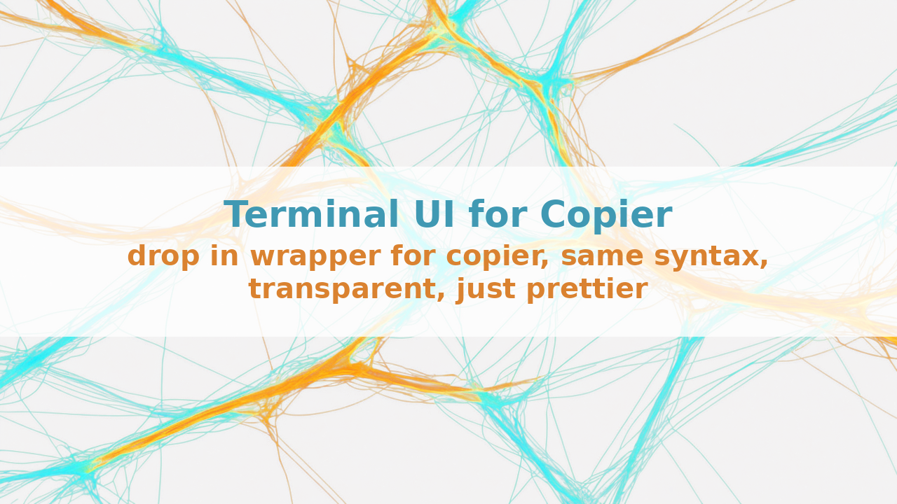
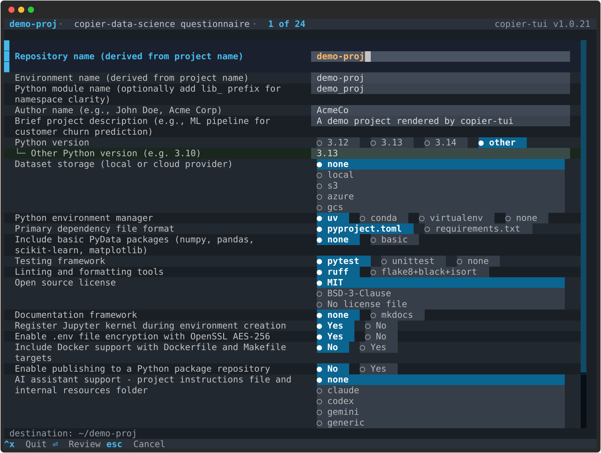

# Terminal UI for Copier Templates



*drop in wrapper for copier, same syntax, transparent, just prettier*

---

## The problem

**Copier** is a project scaffolding tool: it reads a template, asks you a set of questions, and renders a new project from your answers.

If you have ever filled in a long copier questionnaire, you know the feeling. My data science template asks 35 questions, and 12 of them only appear depending on what you answered earlier. Copier asks them one at a time. Get question 30 wrong and there is no way back to question 29 - you kill the process and start again from the top.

That is a UI problem, not a templating problem.

## What it looks like



Every question sits on one screen. Caption on the left, answer on the right, and a question you answer by picking prints all of its options on that same row, so what you passed over stays readable beside what you took. Up and down move between questions, left and right between options. Nothing is written to disk until you confirm on the review screen.

Conditional questions appear and disappear in place as you answer, and everything you have already typed survives the recalculation.

## Two packages, one job each

Copier's extension points are Jinja extensions. There is no supported way to replace its prompt frontend. The workable route is to treat copier as the template engine and hand it answers through its Python API - answers passed as data are never prompted for interactively.

That constraint is the whole design:

- **copier-ui** reads `copier.yml` and turns it into a normalised schema: questions, dependency graph, visibility, validation, answer state. It imports nothing that assumes a display and needs no event loop. A test enforces that over the import graph
- **copier-tui** maps the nine question kinds to Textual widgets and holds no semantics of its own. It never evaluates a `when` and never computes a default

A browser frontend is then a second renderer on the same schema rather than a second parser for `copier.yml`. Every existing copier template gets the alternative UI with no change to the template.

## Using it

```bash
uv tool install copier-tui
copier-tui copy gh:stellarshenson/copier-data-science ./my-project
```

The command line is copier's own: same subcommands, same flags, same short forms. Swapping `copier` for `copier-tui` changes the interface and nothing else.

## What it does not do yet

- The terminal is the only renderer that exists. The HTTP and browser frontends are in the design and not built
- The one-screen layout needs 60 columns by 18 rows; below that it shows a resize prompt instead
- It is validated against one reference template of 35 questions plus a fixture suite, at 188 tests and 93% line coverage. A template using a question kind those do not exercise is untested ground
- Copier stays in charge of rendering, so anything copier cannot do, this cannot do either

MIT, on PyPI as `copier-tui`, source at [github.com/stellarshenson/copier-tui](https://github.com/stellarshenson/copier-tui).

---

*Konrad "Stellars" Jelen builds data science tooling and writes about the parts that turned out harder than expected.*
